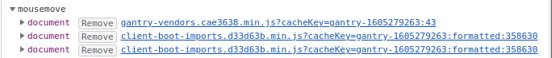

Little Slack
============

Little slack is a minimal slack client in a browser extension, written in plain HTML, CSS, and Javascript.

Hopefully someone can fork this and get it to a usable state. I won't be accepting merge requests or adding much more to this repo.

Install
-------

1. Check code to see if I'm stealing your tokens / cookies
2. Be signed into slack already
3. Firefox: [about:debugging#/runtime/this-firefox](about:debugging#/runtime/this-firefox "about:debugging#/runtime/this-firefox") Chrome: [chrome://extensions/](chrome://extensions/) , enable developer mode
4. Go to [https://app.slack.com/robots.txt](https://app.slack.com/robots.txt)

Features
--------

Messages, reactions...not many.

Why?
----

According to the Firefox Developer Tools Network Tab, slack is 13.70MB of Javascript. The memory tab says it's using 106MB.

Little slack currently uses about 3MB of memory.


Why is Slack so big?
--------------------

Including deprecated classes
```
class deprecated_small_unified_member_DeprecatedSmallUnifiedMember extends i.PureComponent {
class deprecated_medium_unified_member_DeprecatedMediumUnifiedMember extends i.PureComponent {
class deprecated_large_unified_member_DeprecatedLargeUnifiedMember extends i.PureComponent {
```

Including billing stuff
```
class dunning_notice_day_one_banner_DunningNoticeDayOneBanner extends n.PureComponent {
class dunning_notice_day_three_banner_DunningNoticeDayThreeBanner extends n.Component {
class dunning_notice_day_seven_owner_cardholder_banner_DunningNoticeDaySevenOwnerCardholderBanner extends n.PureComponent {
class dunning_notice_day_seven_admin_billing_banner_DunningNoticeDaySevenAdminBillingBanner extends n.PureComponent {
class dunning_notice_day_14_admin_billing_banner_DunningNoticeDay14AdminBillingBanner extends n.PureComponent {
class dunning_notice_day_14_owner_cardholder_banner_DunningNoticeDay14OwnerCardholderBanner extends n.PureComponent {
class dunning_notice_day_21_billing_stakeholders_banner_DunningNoticeDay21BillingStakeholdersBanner extends n.PureComponent {
class dunning_notice_day_21_all_users_banner_DunningNoticeDay21AllUsersBanner extends n.PureComponent {
```

Excessive amounts of classes for trials
```
class one_week_left_tenured_discount_banner_OneWeekLeftTenuredDiscountBanner extends n.PureComponent {
class one_day_left_tenured_discount_banner_OneDayLeftTenuredDiscountBanner extends n.PureComponent {
class esc_trial_banner_EscTrialBanner extends n.PureComponent {
class two_weeks_left_esc_trial_banner_TwoWeeksLeftEscTrialBanner extends n.PureComponent {
class one_week_left_esc_trial_banner_OneWeekLeftEscTrialBanner extends n.PureComponent {
class seven_days_left_trial_banner_SevenDaysLeftTrialBanner extends n.PureComponent {
class three_days_left_esc_trial_banner_ThreeDaysLeftEscTrialBanner extends n.PureComponent {
class three_days_left_trial_banner_ThreeDaysLeftTrialBanner extends n.PureComponent {
class approaching_file_limit_banner_ApproachingFileLimitBanner extends n.PureComponent {
class approaching_msg_limit_banner_ApproachingMsgLimitBanner extends n.PureComponent {
class just_reached_msg_limit_banner_JustReachedMsgLimitBanner extends n.PureComponent {
class thirty_days_after_msg_limit_banner_ThirtyDaysAfterMsgLimitBanner extends n.PureComponent {
```

There's somewhere around 1000 compontents in client-boot-imports.min.js, but only about 150 are used for basic messaging.

There's far too much code to go through, so it's hard to say what it's all doing.


Why does slack feel slow?
-------------------------

Firing the same event listener for mousemove twice doesn't help:



It looks like there's far too many event listeners generally. Parsing 10+MB of Javascript is always going to add some loading time.

